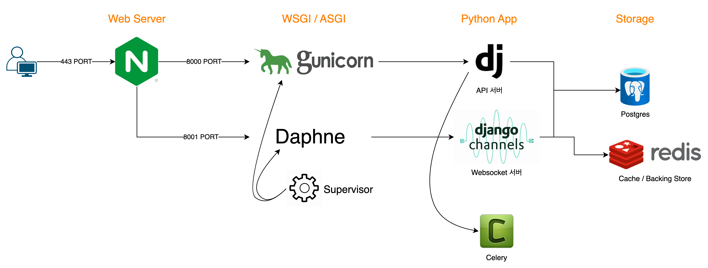

# Django_Template

이 프로젝트의 목적은 Django라는 Framework를 사용하면서,   
해당 Framework에서 사용할 수 있는 각종 기능(Auth, Middleware 등)을 공부하고,   
새로운 장고 서비스를 시작할 때 템플릿으로 사용하기 위한 프로젝트입니다.  



해당 프로젝트는 Docker Compose를 이용해 구동할 수 있으며, 아래 그림과 같은 아키텍처 구조를 갖고있습니다.

## Usage
* ```docker-compose up -d```
* ```docker-compose -f docker-compose_local up -d // local 실행```
    * .env
        ```
        SECRET_KEY=django-insecure-z^y14w-b*meb*%64-9zjy_dc3qmk)ddn)b$2z)2w_c(8h_c6qn
        ELASTICSEARCH_DSL_IP=0.0.0.0
        ELASTICSEARCH_DSL_PORT=5000
        LOGSTASH_PORT=0.0.0.0

        POSTGRES_DB=postgres
        POSTGRES_USER=postgres
        POSTGRES_PASSWORD=postgres
        POSTGRES_HOST=postgres
        ```
## Custom User Model & Auth
[사용자 정의 User Model을 생성하고, 해당 User Model을 이용하는 JWT 인증방식을 알아본다.](descriptions/auth.md)
## Middleware

## Exception

## Channels

## Celery
